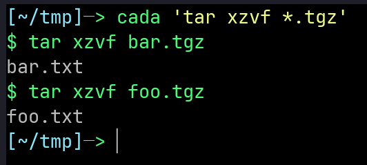

# para-cada


[  ](https://gergelyk.github.io/para-cada/tutorial.html)
[  ](https://gergelyk.github.io/para-cada/examples.html)
[  ](https://gergelyk.github.io/para-cada/reference.html)

*Para Cada* in Spanish means *For Each*. The tool executes your command for each file selected using glob expression(s).

Why? Let's say you have multiple `.tgz` archives and you would like to extract them in one shot. Some of the options available in bash are:

```sh
ls *.tgz | xargs -IT tar xzvf T
for T in *.tgz; do tar xzvf $T; done
find . -type f -name '*.tgz' -exec tar xzvf {} \;
```

All of them are relatively complex. This is where cada can help. Simply do:

```sh
cada 'tar xzvf *.tgz'
```

<div align="center">

</div>

<br>

Cada knows how glob expressions work and executes the entire command with subsequent values corresponding to your glob expression. Additionally, users may transform/filter/sort those values using regular Python syntax. Take a look at the [documentation](https://gergelyk.github.io/para-cada/).

## Installation

Requirement: Python >= 3.8

```sh
pip install para-cada
```

