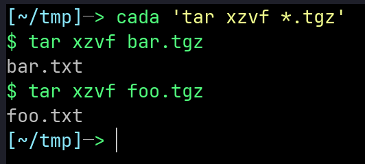

<script data-goatcounter="https://para-cada.goatcounter.com/count" async src="//gc.zgo.at/count.js"></script>

# Motivation

In Spanish, *Para Cada* means *For Each*. The tool executes your command for each file selected using glob expression(s).

Why? Let's say you have multiple `.tgz` archives and you would like to extract them in one shot. Some of the options available in bash are:

```sh
ls *.tgz | xargs -IT tar xzvf T
for T in *.tgz; do tar xzvf $T; done
find . -type f -name '*.tgz' -exec tar xzvf {} \;
```

Each of them is relatively complex. This is where cada can help. Simply do:

```sh
cada 'tar xzvf *.tgz'
```

Cada knows where glob expression is. It executes entire command with subsequent values corresponding to this expression:

<p align="center">
  
</p>

Additionally, user may transform/filter/sort those values using regular Python syntax.

# Installation

Requirement: Python >= 3.8

```sh
pip install para-cada
```

# Documentation

- [Tutorial](tutorial.html)
- [Examples](examples.html)
- [Reference](reference.html)
